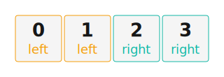

# ZMK Configuration for rightball tester

*Generated by Shield Wizard for ZMK*



Download compiled firmware from the Actions tab. <https://zmk.dev/docs/user-setup#installing-the-firmware>

Edit your keymap <https://zmk.dev/docs/keymaps>.
User keymap is located at [`config/rightball_tester.keymap`](config/rightball_tester.keymap).

-----

<details>
<summary>
Shield Wizard Debug Information
</summary>

In case of broken configuration, here is the Shield Wizard internal data used to generate this configuration:

Commit: 8a52249f61161469b6d90ed8c80c4aa52b9f3858

```json
{"name":"rightball tester","shield":"rightball_tester","dongle":false,"modules":["badjeff/pmw3610"],"layout":[{"id":"01KH0B0BXBDA4VBQFVSBA1B8KV","part":0,"row":0,"col":1,"w":1,"h":1,"x":1,"y":0,"r":0,"rx":0,"ry":0},{"id":"01KH0B0C21SVMBP27DTT4APZ5C","part":0,"row":0,"col":2,"w":1,"h":1,"x":2,"y":0,"r":0,"rx":0,"ry":0},{"id":"01KH0B0C807VNVMQJY52XTRVGE","part":1,"row":0,"col":3,"w":1,"h":1,"x":3,"y":0,"r":0,"rx":0,"ry":0},{"id":"01KH0B0CD0KV6QRQD12EST8004","part":1,"row":0,"col":4,"w":1,"h":1,"x":4,"y":0,"r":0,"rx":0,"ry":0}],"parts":[{"name":"left","controller":"nice_nano_v2","wiring":"matrix_diode","pins":{"d9":"output","d8":"output","d10":"input"},"keys":{"01KH0B0BXBDA4VBQFVSBA1B8KV":{"input":"d10","output":"d8"},"01KH0B0C21SVMBP27DTT4APZ5C":{"input":"d10","output":"d9"}},"encoders":[],"buses":[{"name":"spi0","devices":[],"type":"spi"},{"name":"spi1","devices":[],"type":"spi"},{"name":"spi2","devices":[],"type":"spi"},{"name":"spi3","devices":[],"type":"spi"},{"name":"i2c0","devices":[],"type":"i2c"},{"name":"i2c1","devices":[],"type":"i2c"}]},{"name":"right","controller":"nice_nano_v2","wiring":"matrix_diode","pins":{"d9":"output","d10":"input","d16":"input","d2":"bus","d3":"bus","d4":"bus","d5":"bus"},"keys":{"01KH0B0C807VNVMQJY52XTRVGE":{"input":"d16","output":"d9"},"01KH0B0CD0KV6QRQD12EST8004":{"input":"d10","output":"d9"}},"encoders":[],"buses":[{"name":"spi0","devices":[{"type":"pmw3610","cs":"d4","irq":"d5","cpi":600,"swapxy":false,"invertx":false,"inverty":false}],"type":"spi","mosi":"d2","miso":"d2","sck":"d3"},{"name":"spi1","devices":[],"type":"spi"},{"name":"spi2","devices":[],"type":"spi"},{"name":"spi3","devices":[],"type":"spi"},{"name":"i2c0","devices":[],"type":"i2c"},{"name":"i2c1","devices":[],"type":"i2c"}]}]}
```

</details>
